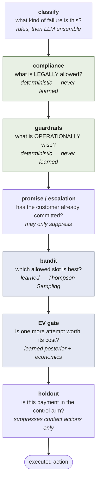
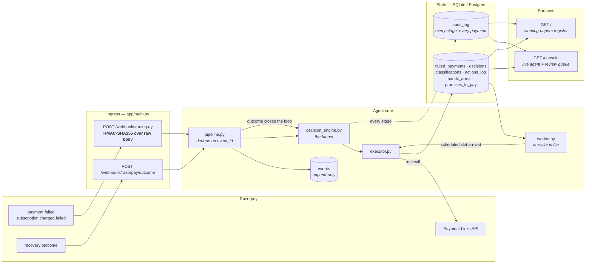
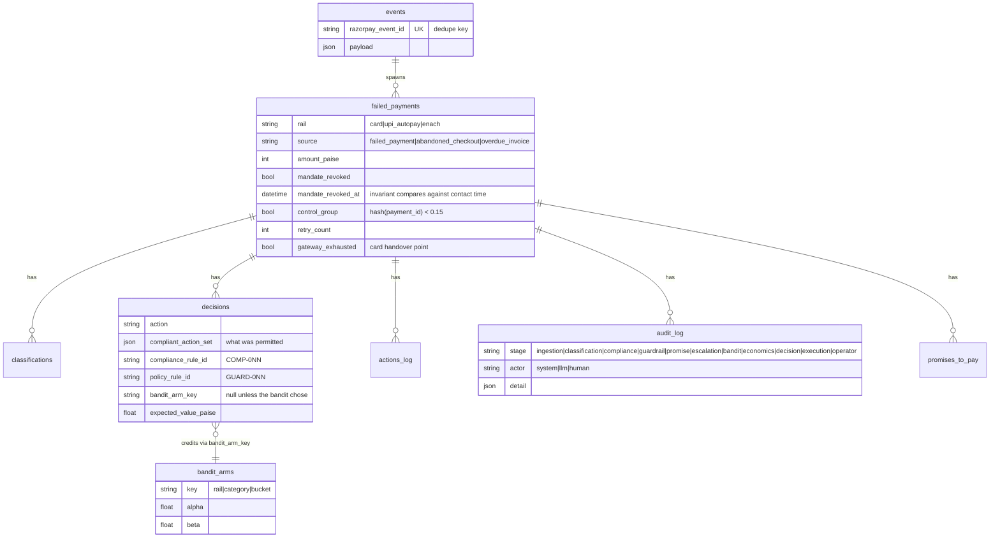
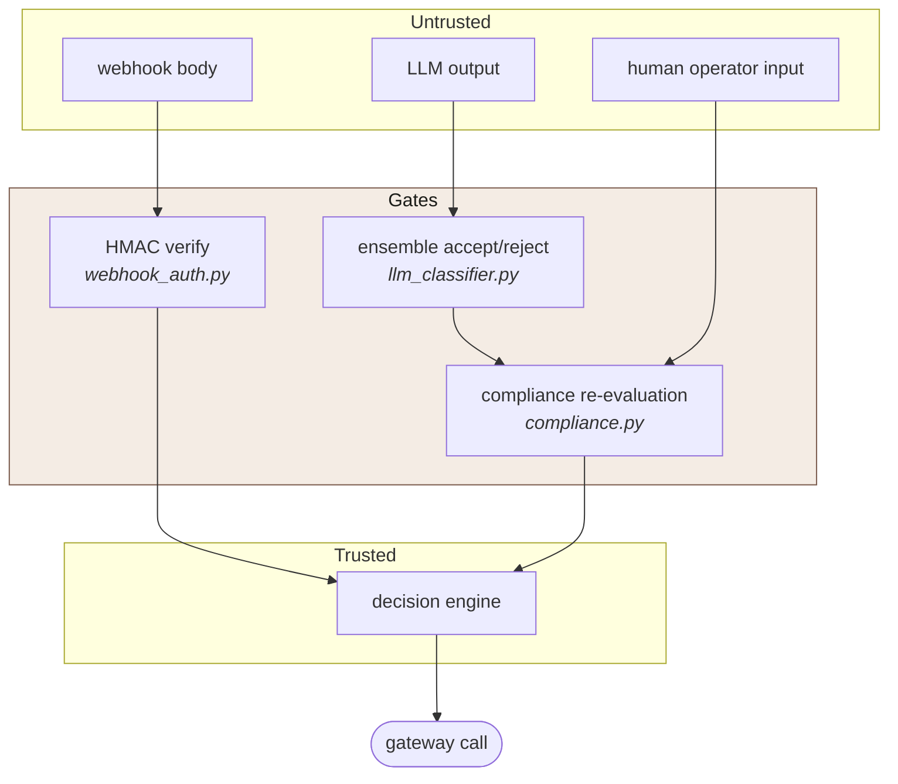

# Architecture

A recovery agent for revenue that is slipping away: it ingests Razorpay webhooks,
classifies why money failed to arrive, decides what is legally and economically
worth doing about it, and executes a bounded workflow — leaving a full reasoning
trace behind every money action.

This document is the map. [`README.md`](README.md) is the argument — why each
decision is the way it is, and what the measurements say about whether it works.

---

## 1. The one invariant

Everything below exists to hold a single property:

> **Compliance is deterministic and hard-coded. Only the optimisation inside the
> already-compliant action set is learned.**

The decision pipeline is a **narrowing funnel**. Each stage may shrink the set of
actions the previous stage permitted; **no stage may widen it.**



Concretely, in [`app/decision_engine.py`](app/decision_engine.py):

- The bandit only runs `if compliant_action in ("retry_now", "retry_at")` — it
  chooses **among** slots compliance already returned, and cannot invent an action
  or extend a retry window.
- The EV gate's only possible write is `compliant_action = "stop_lost"`. It is a
  one-way valve: it can refuse an action, never authorise one.
- A promise to pay can only ever downgrade a contact action to `wait`. It never
  creates a contact, shortens a compliance window, or reopens a stopped case.
- The holdout suppresses **contact actions only**. A compliance hard-stop is the
  *absence* of an intervention, so it must land identically in both arms — otherwise
  the arms end in different terminal states and the causal comparison is biased.

---

## 2. System shape



**Both entry points are idempotent on `event_id`.** Razorpay redelivers webhooks;
the append-only `events` table is the source of truth, so derived state can be
rebuilt by replay.

---

## 3. Three sources, three regimes

Track 03 names three kinds of slipping revenue. They are one *problem shape* —
detect, decide, act, bounded — and emphatically **not one compliance regime**.
Collapsing them is what makes a recovery agent creepy or illegal.
See [`app/sources.py`](app/sources.py).

| | debt owed | mandate held | contact budget | ladder | retry exists | LTV multiple |
|---|---|---|---|---|---|---|
| `failed_payment` | yes | yes | 3 | full | yes (mandate rails) | 12× |
| `abandoned_checkout` | **no** | no | **1** | **none** | **no** | **0×** |
| `overdue_invoice` | yes | no | 4 | full | **no** | 2× |

`SourceProfile` is the single object that carries this: `is_debt`, `has_mandate`,
`max_contacts`, `escalation_allowed`, `allowed_actions`, `contact_window_applies`,
`ltv_multiple`. Compliance reads it *before* it reads decline category, because for
two of the three sources there is no decline to classify at all.

---

## 4. Module map

### Deterministic core — never learned

| Module | Responsibility |
|---|---|
| [`taxonomy.py`](app/taxonomy.py) | `(rail, error_code) → Category`. Per-rail error maps for Card / UPI Autopay / eNACH. |
| [`compliance.py`](app/compliance.py) | The legal action set. Emits a `COMP-0NN` rule id with every verdict. |
| [`contact_policy.py`](app/contact_policy.py) | RBI Fair Practices contact window, **in IST**. Separates a silent debit from a customer contact. |
| [`guardrails.py`](app/guardrails.py) | Operational, not legal: daily contact cap, per-issuer circuit breaker. Emits `GUARD-0NN`. |
| [`sources.py`](app/sources.py) | The three revenue-at-risk regimes and their profiles. |
| [`receivables.py`](app/receivables.py) | MSMED Act s.15/s.16/s.43B(h) — statutory interest, monthly rests. |
| [`escalation.py`](app/escalation.py) | The 4-rung ladder. Escalates channel and human involvement, never pressure. |
| [`promises.py`](app/promises.py) | Promise-to-pay records; suppression, supersession, grace period. |

### Learned edge

| Module | Responsibility |
|---|---|
| [`bandit.py`](app/bandit.py) | Thompson Sampling over `(rail, category, tod_bucket)` — 3 rails × 2 retryable categories × 4 buckets = **24 arms**, Beta(α, β) per arm. |
| [`economics.py`](app/economics.py) | `EV = P(recovery)·amount − contact_cost − P(churn)·LTV`. The churn term is what makes the gate actually bind. |

### LLM tier — used only where the rules run out

| Module | Responsibility |
|---|---|
| [`classifier.py`](app/classifier.py) | Two-tier dispatch: rule lookup first, ensemble only on free-text narration. |
| [`llm_classifier.py`](app/llm_classifier.py) | Self-consistency ensemble across three **framings** (direct / consequence / exclusion), not three samples. |
| [`llm.py`](app/llm.py) | Anthropic client wrapper. `available()` is false without a key, and the whole tier goes inert. |
| [`messaging.py`](app/messaging.py) | Templates ship; a generated draft must pass validation to replace one. Off by default. |
| [`voice.py`](app/voice.py) | TRAI-gated Hinglish call script. **Decides lawfulness and writes the script; does not dial.** |

### Plumbing

| Module | Responsibility |
|---|---|
| [`pipeline.py`](app/pipeline.py) | Ingest → decide → execute; outcome ingestion closes the bandit loop. Idempotent. |
| [`decision_engine.py`](app/decision_engine.py) | The funnel in section 1. |
| [`executor.py`](app/executor.py) | Action → gateway call. `RazorpayGateway` / `DryRunGateway`. |
| [`webhook_auth.py`](app/webhook_auth.py) | HMAC-SHA256 over the **raw** body, `compare_digest`. |
| [`worker.py`](app/worker.py) | Polls `WAITING` payments whose slot has arrived. |
| [`audit.py`](app/audit.py) | One append-only row per stage per payment. |
| [`metrics.py`](app/metrics.py) | Causal lift, net value, **compliance invariants over executed actions**. |
| [`timeutil.py`](app/timeutil.py) | Timezone-aware `utcnow` / `as_aware`. Load-bearing — see `contact_policy`. |

---

## 5. Data model



Two modelling choices carry weight:

- **`mandate_revoked_at` is a timestamp, not a flag.** A customer can revoke *after*
  a contact that was entirely legal when it was made. "Does a revoked payment have
  any contacts?" is a different — and wrong — question from "did we contact after
  revocation?".
- **`decisions.compliant_action_set` stores what was *permitted*, alongside what was
  *done*.** Without it, the trail cannot show that the gate ever stopped anyone.

---

## 6. Where AI is, and where it deliberately is not

| Decision | Mechanism | Why |
|---|---|---|
| Decline category, clean `error_code` | **Dict lookup** | Faster, free, and *more* accurate than a model. |
| Decline category, free-text bank narration | **LLM ensemble** | Every bank writes its own wording; no rule table covers it exhaustively. |
| Is this action legal? | **Hard-coded rules** | A learned compliance rule is an unauditable compliance rule. |
| Which retry slot? | **Thompson Sampling** | Genuine explore/exploit over a hidden time-of-day effect. |
| Stop or continue? | **EV arithmetic on a learned posterior** | The posterior is learned; the arithmetic is not. |
| Customer copy | **Templates; model may only improve** | SMS/WhatsApp run on DLT-registered templates — free-form copy is not legally sendable. |
| Whether to place a call | **Rule gate; model writes the script** | TRAI positional rules cannot be verified against a prose blob. |

**With no `ANTHROPIC_API_KEY` the entire LLM tier is inert** and the system behaves
exactly as it did before the tier existed: the rule table still classifies every
clean error code, free-text narrations route to human review rather than being
guessed at, and templates ship as written.

---

## 7. Failure modes and fallbacks

Every one of these is exercised by the test suite.

| Failure | Detection | Fallback |
|---|---|---|
| LLM: split vote, tie, low confidence, API error, safety refusal, no key | `llm_classifier` ensemble verdict | → `UNKNOWN` → `escalate_human` under COMP-002 |
| Even split (`2 votes, 50/50`) | Explicit majority check | Rejected — `Counter.most_common` would break the tie by insertion order |
| Webhook redelivered | `event_id` uniqueness | Second delivery is a no-op |
| Webhook forged / unsigned | HMAC over raw body | `401`, before parsing |
| Gateway 5xx | HTTP status class | Recorded `pending`, **not** `failed` — a "failure" would license a second link against one debt |
| Gateway 4xx | HTTP status class | Recorded `failed` — request rejected, nothing created |
| Duplicate payment link | Stable `reference_id` | Collides server-side |
| Live (`rzp_live_`) credentials | Key prefix check | `UnsafeCredentials` raised — every amount here is synthetic |
| No Razorpay credentials | Config absent | `DryRunGateway`; full pipeline still runs offline |
| Issuer-wide outage | Rolling-window decline rate | Circuit breaker opens; retries back off |
| Unverified API (`retry_charge`, `request_new_mandate`) | — | `NotImplementedError` — raises rather than faking success |
| Human tries to authorise a forbidden action | Compliance re-run on write-back | `409`, refusal written to the trail as `actor: human` |

The last row is the load-bearing one. If clicking a button could authorise an action
the rules forbid, every rule in `compliance.py` would be advisory.

---

## 8. Surfaces

| Endpoint | Purpose |
|---|---|
| `POST /webhooks/razorpay` | Failure ingress. Signature-verified. |
| `POST /webhooks/razorpay/outcome` | Outcome ingress — closes the bandit loop. |
| `GET /payments` | The register. |
| `GET /payments/{id}/audit` | **Full reasoning trace**, including raw Thompson draws. |
| `GET /metrics/overview` · `/compliance` · `/bandit` · `/stop-reasons` · `/rules-fired` | Measurement. |
| `GET /agent/activity` · `/queue` · `/pulse` | Live console feed (cursor-based, not time-based). |
| `POST /agent/queue/{id}/resolve` | The one place a human writes back — still bound by compliance. |
| `GET /console` | Live agent view + human review queue. |
| `GET /` | Operations dashboard, built as auditor's working papers. |

The activity feed is **cursor-based, not time-based**, and that is not incidental: a
single `decide()` cycle writes eight or more audit rows at one instant, so a
`since_timestamp` feed would either drop rows sharing the boundary or serve them twice.

---

## 9. Trust boundaries



An LLM verdict enters the system as a *category*, never as an action. It can move a
payment between compliant actions; it cannot invent one. Human input passes through
the same compliance gate as machine input.

---

## 10. Measurement architecture

Two things make the numbers mean something, and both are structural rather than
reported:

**A 15% no-contact holdout**, assigned by `blake2b(payment_id) < 0.15` — deliberately
not a live RNG draw, which would make assignment depend on how many random numbers
were consumed before it, so the control arm's composition would shift whenever
unrelated logic changed. Hashing the unit id keeps assignment reproducible,
order-independent, and stable across policy variants. That is what makes a comparison
between variants valid at all.

**Compliance verified as invariants over executed actions**, in `metrics.py` — never
inferred from a record's status. Only whether a contact was *actually executed
against the gateway* tells you whether a rule was breached.

```
[PASS] contacted after mandate revocation: 0
[PASS] control-group payments contacted: 0
[PASS] payments exceeding attempt cap: 0
[PASS] risk-blocked payments auto-actioned: 0
[PASS] abandoned checkouts contacted more than once: 0
[PASS] retry attempted without a mandate: 0
```

CI runs these against 300 synthetic payments driven through the whole pipeline and
**fails the build on any breach** — so a green tick means no contact rule was
violated, not merely that tests passed.

---

## 11. Running it

```bash
python -m venv .venv && source .venv/Scripts/activate
pip install -r requirements.txt
cp .env.example .env
```

Zero external services: SQLite by default, `DryRunGateway` whenever Razorpay
credentials are absent.

```bash
python -m pytest tests/ -q                 # full suite, offline
python -m scripts.seed_synthetic_data 300  # full pipeline + causal lift + learned arms
python -m scripts.ablation 400 12          # does the learned machinery earn its keep?
uvicorn app.main:app --reload              # console at /console, register at /
```

---

## 12. What this architecture does not yet do

Named plainly, because a system that hides these is worse than one that admits them.
Full list in [README § Known limitations](README.md#known-limitations).

- **`retry_charge` is not wired to a verified API.** Only Payment Links is a confirmed
  Razorpay call. On the mandate rails the central recovery action raises rather than
  pretending.
- **No off-policy evaluation before a policy is promoted.** A bandit update takes
  effect immediately.
- **The world is synthetic.** The bandit demonstrably recovers a hidden structure it
  was never told, and the ablation is internally valid — but no number here is a claim
  about real Razorpay traffic.
- **Time-of-day buckets are UTC**, not customer-local, which matters for exactly the
  salary-cycle effect being exploited.
- **Voice does not dial**; the carrier integration, DLT-registered 1600-series
  originator and live NCPR lookup are not built.
